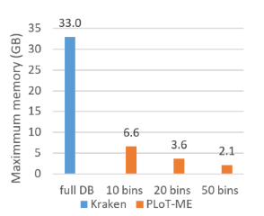

# PLoT-ME
**Pre-classification of Long-reads for Memory Efficient Taxonomic assignment <br>**
Sylvain Riondet, Niranjan Ngarajan, NUS/SoC, GIS/Biopolis, Singapore


## Description
#### Pre-Processing
- Segmentation of NCBI RefSeq into clusters
- Building of taxonomic classifiers' indexes for each cluster

#### Classification
Taxonomic classification of mock communities / metagenomic fastq files
- Assignment of long DNA reads (Nanopore/PacBio) to each cluster
- Classification by the classifier with a subset of RefSeq
- Merging of reports

Kraken2 _(Derrick E. Wood et al. 2019)_ and Centrifuge _(D.Kim et al. 2016)_ are currently automated, and any classifier able to build its index on a set of .fna files with a provided taxid should work.

## Take-aways

- High reduction in memory needs, defined by the number of clusters *
- _Compatible_ and _enhancing_ existing taxonomic classifiers
- Slight over-head of the pre-classification (currently ~3-5x in time, improvements for future releases) 

\* Mini Batch K-Means, _Web-Scale K-Means Clustering D. Sculley 2010_

## Requirements
- Linux (tested on Ubuntu 18.04)
- Taxonomic classifier
    - Kraken2 or Centrifuge (feel free to request support for more)
- Python >= 3.7

    Package | Version
     --- | --- 
    biopython   | \>= 1.72
    ete3        | \>= 3.1.1
    numpy       | \>= 1.17.3
    pandas      | \>= 0.23
    scikit-learn| \>= 0.18
    tqdm        | \>= 4.24.0


## Installation
Create a Python 3 environment with [conda](https://docs.conda.io/projects/conda/en/latest/user-guide/tasks/manage-environments.html)
 or [pyenv](https://realpython.com/intro-to-pyenv/). <br>
Installation is then done with pip: <br>
`python3 -m pip install plot-me` <br>
This will create 2 commands, `plot-me.preprocess` and `plot-me.classify` detailed in the 'Usage'.  <br> 
<br>
It is also possible to clone [PLoT-ME's repo](https://github.com/sylvain-ri/PLoT-ME),
 and launching commands directly with python `path/to/PLoT-ME/parse_DB.py or classify.py`

## Usage
#### Pre-Processing
For the full help: `plot-me.preprocess -h`  <br>
Typical usage:  <br>
`plot-me.preprocess <path/NCBI/refseq> <folder/for/clusters> <path/taxonomy> 
 -k 4 -w 10000 -n 10 -o <OmitFoldersContainingString>` <br>
#### Pre-classification + classification
For the full help: `plot-me.classify -h`  <br>
Typical usage:  <br>
`plot-me.classify <folder/with/clusters> <folder/reports> 
 -i <fastq files to preclassify>` <br>

#### Example
```
/mnt/data
|-- mock_files
|   |-- mock_community_1.fastq
|   |   \-- minikm_b10_k3_s10000_oplant-vertebrate (one tmp file per cluster, generated by PLoT-ME)
|   \-- mock_community_2.fastq
|-- PLoT-ME
|   |-- k3_s10000
|   |   | -- kmer_counts
|   |   |    |-- counts.k3_s10000 (same tree as RefSeq, with <sequencing_name>.3mer_count.pd)
|   |   |    \-- all-counts.k3_s10000_oplant-vertebrate.csv
|   |   | -- minikm_b10_k3_s10000_oplant-vertebrate               <*>
|   |   |    |-- centrifuge       (10 folders with indexes)
|   |   |    |-- kraken2          (10 folders with indexes)
|   |   |    |-- RefSeq_binned    (10 folders with fna files)
|   |   |    |-- model.minikm_b10_k3_s10000_oplant-vertebrate.pkl
|   |   |    \-- segments-clustered.minikm_b10_k3_s10000_oplant-vertebrate.pd
|   |   \ -- minikm_b20_k3_s10000_oplant-vertebrate
|   |        \-- (same structure) 
|   |-- k4_s10000
|   |   ` --  (same structure)
|   \-- no-binning
|       |-- oAllRefSeq
|       \-- oplant-vertebrate
|           |-- centrifuge
|           \-- kraken2
|-- NCBI
|   \-- refseq
|-- reports
|   \-- mock_community_1 (one report per cluster)
\-- taxonomy
```
This `<*>` can be generated with: <br>
`plot-me.preprocess /mnt/data/NCBI/refseq /mnt/data/PLoT-ME /mnt/data/taxonomy -k 3 -w 10000 -n 10
 -o plant vertebrate` <br>
And can be used with: <br>
`plot-me.classify /mnt/data/PLoT-ME/k3_s10000/minikm_b10_k3_s10000_oplant-vertebrate /mnt/data/reports
 -i /mnt/data/mock_files/mock_community_1.fastq`

## Technical details
Python 3 is the main programming language, with extensive use of libraries. 
Dependencies are resolved using [PIP](https://pypi.org/)

#### Intermediate Data 
Data is saved as pickle `.pkl` or Pandas DataFrame `.pd` <br> 
- **Kmer counts** Pandas DataFrames are saved under `.../kmer_counts/counts.<param>` and have the following columns: <br>
`   taxon	category	start	end	name	description	fna_path	AAAA ... TTTT`
- **Cluster assignments** `segments-clustered.\<param\>.pd` trade the nucleotides columns to a `cluster` column.
- `RefSeq_binned` is the clustering made by PLoT-ME, and holds one folder per cluster, with concatenated segments of genomes (one .fna file per taxa)
- **Libraries** generated by classifier, depends on each of them.

#### Final files
The `model*.pkl` and the folder `kraken2` or `centrifuge` are needed for PLoT-ME to work. Folder tree needs to remain intact. 

#### Work in progress
_As of July 2020:_
- `pre-process` Using large k (5+) and small s (10000-) yield very large kmer counts, costing
 high amounts of RAM (esp. when combining all kmer counts together,
 RAM needs to reach ~30GB or more). 
- `classify` Merging of reports 
- `pre-process` Cleaning of pre-processing files `--clean`

#### Future work
- `classify` Cleaning of pre-classification tmp files
- `classify` Multi cores
- `classify`/`pre-process` Speed up kmer counting
- `pre-process` Even sized bins
- `pre-process` Overlapping clusters or tricks for higher accuracy

## Contact
**Author:** Sylvain Riondet, PhD student at the National University of Singapore, School of Computing <br>
**Email:** _sylvainriondet@gmail.com_ <br>
**Lab:** Genome Institute of Singapore / National University of Singapore<br>
**Supervisors:** Niranjan Nagarajan & Martin Henz <br>


